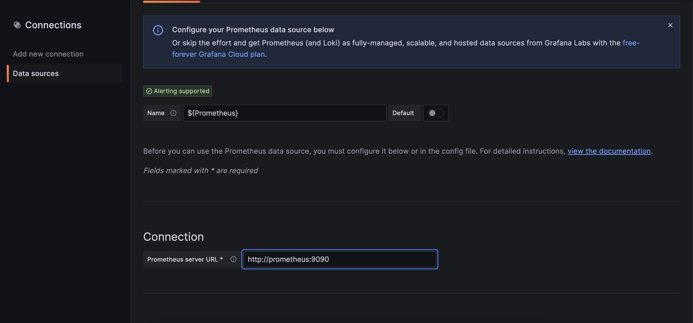

# Local Confluent Platform with Prometheus and Grafana


## start the stack

```bash
docker-compose up -d 
```

wait for all containers to come up

## check prometheus

open http://localhost:9090/targets?search= in a brwoser

all targets should be "green" and available


## create Datasource in grafana

login to Grafana Web UI

http://localhost:3000
user: admin
pw: password


switch to Connections --> Datasource

create a new Datasource for Prometheus which has to be named ${Prometheus}



--> Save & Test

--> preconfigured Dashboard should work
